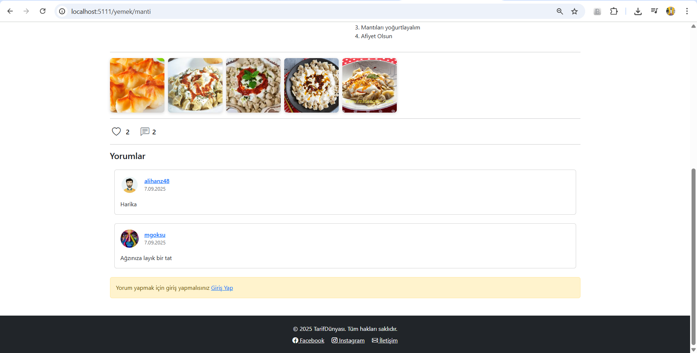

# 🍲 Yemek Tarifleri Web Sitesi

**Yemek Tarifleri**, kullanıcıların çeşitli yemek tariflerini görebileceği, ekleyebileceği ve yönetebileceği bir *.NET Core MVC Web Uygulaması*dır.

---

📝 Özellikler

- Kullanıcılar için **tarif listeleme, detay görüntüleme**.
- Tarif ekleme ve düzenleme fonksiyonları.
- Kategorilere göre tarif filtreleme.
- Modern ve kullanıcı dostu arayüz.
- Hızlı ve güvenli veri yönetimi.
- Tariflere yorum ekleme.
- Tarifleri beğenme.
- Tarifleri kaç kişinin görüntülediğini görme.
- Yemeklerin yayınlanması,yeni kategori eklenmesi ve yetkilendirmeler ancak admin rolüne sahip kullanıcılar tarafından yapılabilir.

---

💻 Kullanılan Teknolojiler

- Backend: C#, .NET Core MVC, Entity Framework Core, LINQ-ORM, Jquery, Claims Identity vb.
- Frontend: HTML5, CSS3, JavaScript, Bootstrap
- Veritabanı: MySQL

---

 
 
 
 
 
 
 
 
 
 
 
 
 
 
 
 
 
 
 
 
 
 
 

